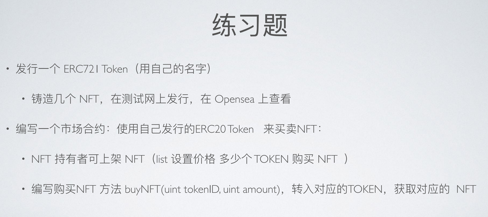

# 练习题 2（01.15）



## ERC721 token 与 NFTMarket 合约

### ERC721 Token Metadata：

**name**: Garen at OpenSpace

**symbol**：GOS

**tokenURI** (tokenId = 0)：ipfs://QmcEGXMjbA176i8j7skXePpc1MQSecHwZf6amuSsry1jS2

**tokenURI** (tokenId = 1)：ipfs://QmNUDMdvTGPgPwQCd3o9v96vntT4e6rrpsGQBDVDhBQizw

### ERC721 Token 合约代码：

```solidity
//SPDX-License-Identifier: MIT
pragma solidity ^0.8.0;

import "@openzeppelin/contracts/token/ERC721/extensions/ERC721URIStorage.sol";
import "@openzeppelin/contracts/utils/Nonces.sol";

contract ERC721Token is ERC721URIStorage, Nonces {
    address owner;
    error NotOwner(address caller);

    constructor() ERC721("Garen at OpenSpace", "GOS") {
        owner = msg.sender;
    }

    modifier onlyOwner() {
        if (msg.sender != owner) {
            revert NotOwner(msg.sender);
        }
        _;
    }

    function mint(address to, string memory tokenURI) public onlyOwner returns (uint256) {
        uint256 newItemId = nonces(address(this));
        _mint(to, newItemId);
        _setTokenURI(newItemId, tokenURI);
        _useNonce(address(this));
        return newItemId;
    }
}
```

### NFTMarket 合约代码：

```solidity
//SPDX-License-Identifier: MIT
pragma solidity ^0.8.0;

import "@openzeppelin/contracts/token/ERC20/IERC20.sol";
import "@openzeppelin/contracts/token/ERC20/ERC20.sol";
import "@openzeppelin/contracts/token/ERC721/IERC721Receiver.sol";
import "@openzeppelin/contracts/token/ERC721/IERC721.sol";

contract NFTMarket is IERC721Receiver {
    mapping(address => mapping(uint => uint)) private price;
    mapping(address => uint) private balance;
    address public immutable tokenAddr;
    mapping(address => mapping(uint => bool)) public onSale;
    error ZeroPrice();
    error NotOwner();
    error BidLessThanPrice(uint bidAmount, uint priceAmount);
    error NotOnSale();
    error withdrawalExceedBalance(uint withdrawAmount, uint balanceAmount);

    // This NFTMarket supports multiple ERC721 token，there's no need to fix the address of 'ERC721token Contract'，
    // Fix the address of ERC20token contract instead.
    constructor(address _tokenAddr) {
        tokenAddr = _tokenAddr;
    }

    function onERC721Received(
        address operator,
        address from,
        uint256 tokenId,
        bytes calldata data
    ) external override returns (bytes4) {
        return this.onERC721Received.selector;
    }

    // Before calling this function, need to approve this contract as an operator of the corresponding tokenId!
    function list(address _nftAddr, uint _tokenId, uint _price) external {
        if (msg.sender != IERC721(_nftAddr).ownerOf(_tokenId))
            revert NotOwner();
        if (_price == 0) revert ZeroPrice();
        require(
            onSale[_nftAddr][_tokenId] == false,
            "This NFT is already listed"
        );
        IERC721(_nftAddr).safeTransferFrom(
            msg.sender,
            address(this),
            _tokenId,
            "List successfully"
        );
        IERC721(_nftAddr).approve(msg.sender, _tokenId);
        price[_nftAddr][_tokenId] = _price;
        onSale[_nftAddr][_tokenId] = true;
    }

    function delist(address _nftAddr, uint256 _tokenId) external {
        // The original owner, is the owner of the NFT when it was not listed.
        require(
            IERC721(_nftAddr).getApproved(_tokenId) == msg.sender,
            "Not original owner or Not on sale"
        );
        if (onSale[_nftAddr][_tokenId] != true) revert NotOnSale();
        IERC721(_nftAddr).safeTransferFrom(
            address(this),
            msg.sender,
            _tokenId,
            "Delist successfully"
        );
        delete price[_nftAddr][_tokenId];
        onSale[_nftAddr][_tokenId] = false;
    }

    // Before calling this function, need to approve this contract with enough allowance!
    function buy(address _nftAddr, uint _tokenId, uint _bid) external {
        if (onSale[_nftAddr][_tokenId] != true) revert NotOnSale();
        if (_bid < price[_nftAddr][_tokenId]) revert BidLessThanPrice(_bid, price[_nftAddr][_tokenId]);
        require(
            msg.sender != IERC721(_nftAddr).getApproved(_tokenId),
            "Owner cannot buy!"
        );
        bool _success = IERC20(tokenAddr).transferFrom(
            msg.sender,
            address(this),
            _bid
        );
        require(_success, "Fail to buy or Allowance is insufficient");
        balance[IERC721(_nftAddr).getApproved(_tokenId)] += _bid;
        IERC721(_nftAddr).transferFrom(address(this), msg.sender, _tokenId);
        delete price[_nftAddr][_tokenId];
        onSale[_nftAddr][_tokenId] = false;
    }

    function getPrice(
        address _nftAddr,
        uint _tokenId
    ) external view returns (uint) {
        return price[_nftAddr][_tokenId];
    }

    function getBalance() external view returns (uint) {
        return balance[msg.sender];
    }

    function getOwner(
        address _nftAddr,
        uint _tokenId
    ) external view returns (address) {
        return IERC721(_nftAddr).ownerOf(_tokenId);
    }

    function withdrawBalance(uint _value) external {
        if (_value > balance[msg.sender]) revert withdrawalExceedBalance(_value, balance[msg.sender]);
        bool _success = IERC20(tokenAddr).transfer(msg.sender, _value);
        require(_success, "withdrawal failed");
        balance[msg.sender] -= _value;
    }
}
```


## 合约部署、验证


**ERC721 Token 合约 URL**：
https://goerli.etherscan.io/address/0x5B9C7018f5DC482BfE4F8dd016a19b210c33b74e

**NFT #0 mint Tx**：https://goerli.etherscan.io/tx/0x22d9c9145b0c84b4f6a7ab54865e48169ccd26aef93cde746ce4338ba3d95853

**NFT #1 mint Tx**：https://goerli.etherscan.io/tx/0xfa5a70234e9f93a5bc88f1ae84e7ac6ee2ed3ca0b1c97c30036acbd35e69412b

**NFTMarket 合约 URL**：
https://goerli.etherscan.io/address/0x40957E3A016B9d673a390625A058331195C4b318

## 在 OpenSea 上查看 NFT

截止作业完成后的半小时内，OpenSea (for testnets) 暂未同步本练习题所部署的 token，无法正常查看；后续若同步完成，则届时更新页面截图。


