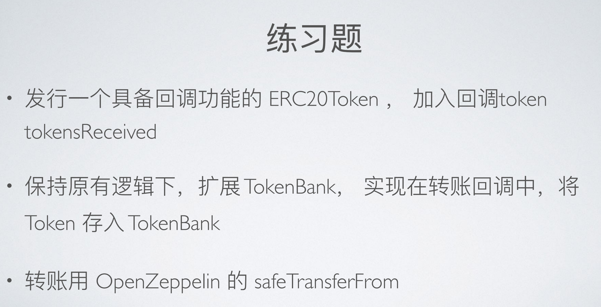

# 练习题 1（01.15）




## 发行一个具备回调功能的 ERC20Token，加入回调函数

```solidity
// SPDX-License-Identifier: MIT
pragma solidity ^0.8.0;

import "@openzeppelin/contracts/token/ERC20/ERC20.sol";
import "@openzeppelin/contracts/token/ERC20/extensions/ERC20Permit.sol";
import "@openzeppelin/contracts/utils/ReentrancyGuard.sol";
import "@openzeppelin/contracts/utils/Address.sol";
import "@openzeppelin/contracts/token/ERC20/utils/SafeERC20.sol";

interface IRecipientContract {
    function tokensReceived(address, uint) external returns (bool);
}

contract ERC777TokenGTT is ERC20, ERC20Permit, ReentrancyGuard {
    using SafeERC20 for ERC777TokenGTT;
    using Address for address;
    address private owner;
    error NotOwner(address caller);
    error NoTokenReceived();
    error transferFail();
    event TokenMinted(uint amount, uint timestamp);

    constructor()
        ERC20("Garen Test Token", "GTT")
        ERC20Permit("Garen Test Token")
    {
        owner = msg.sender;
        /// @dev Initial totalsupply is 100,000
        _mint(msg.sender, 100000 * (10 ** uint256(decimals())));
    }

    modifier onlyOwner() {
        if (msg.sender != owner) {
            revert NotOwner(msg.sender);
        }
        _;
    }

    function mint(address _recipient, uint _amount) external onlyOwner {
        _mint(_recipient, _amount);
        emit TokenMinted(_amount, block.timestamp);
    }

		// 增加回调函数，调用目标合约的 tokensReceived 函数（需提前实现其功能）
    function transferWithCallback(
        address _to,
        uint _amount
    ) external nonReentrant returns (bool) {
        bool transferSuccess = transfer(_to, _amount);
        if (!transferSuccess) {
            revert transferFail();
        }
        if (_isContract(_to)) {
            bool success = IRecipientContract(_to).tokensReceived(
                msg.sender,
                _amount
            );
            if (!success) {
                revert NoTokenReceived();
            }
        }
        return true;
    }

    function _isContract(address account) internal view returns (bool) {
        return account.code.length > 0;
    }
}
```


## 扩展 TokenBank：在转账回调中，将 Token 存⼊ TokenBank

**TokenBank 合约**中的 **depositToken 方法** 和 **withdrawToken() 方法** 的转账分别改⽤ **OpenZeppelin** 的 **safeTransferFrom 方法** 和 **safeTransferFrom 方法**，并实现了在**回调函数 tokensReceived** 中实现将 token 存入此 **TokenBank** 合约的功能。

```solidity
// SPDX-License-Identifier: MIT
pragma solidity ^0.8.0;

import "./Bank.sol";
import "@openzeppelin/contracts/token/ERC20/utils/SafeERC20.sol";

interface IERC20TokenGTT {
    function transferFrom(address, address, uint256) external returns (bool);

    function balanceOf(address) external view returns (uint256);

    function transfer(address, uint256) external returns (bool);

    function safeTransferFrom(IERC20, address, address, uint256) external;

    function safeTransfer(IERC20, address, uint256) external;
}

contract TokenBank is Bank {
    mapping(address => uint) internal tokenBalance;
    address[3] internal tokenRank;
    address public immutable tokenAddr;
    IERC20TokenGTT public immutable iGTT;
    IERC20 public immutable iERC20Token;
    using SafeERC20 for IERC20;
    event tokenReceived(address sender, uint amount);
    error WrongTokenReceived(address inputAddr, address validAddr);

    constructor(address _tokenAddr) {
        owner = msg.sender;
        tokenAddr = _tokenAddr;
        iGTT = IERC20TokenGTT(_tokenAddr);
        iERC20Token = IERC20(_tokenAddr);
    }

    function depositToken(uint _tokenAmount) public {
        iERC20Token.safeTransferFrom(msg.sender, address(this), _tokenAmount);
        tokenBalance[msg.sender] += _tokenAmount;
        _handleRankWhenDepositToken();
    }

    function withdrawToken() public onlyOwner {
        iERC20Token.safeTransfer(owner, iGTT.balanceOf(address(this)));
    }

    function tokensReceived(
        address _from,
        uint _amount
    ) external returns (bool) {
        if (msg.sender != address(tokenAddr)) {
            revert WrongTokenReceived(msg.sender, tokenAddr);
        }
        tokenBalance[_from] += _amount;
        emit tokenReceived(_from, _amount);
        return true;
    }

    function getTokenBalance(address _account) public view returns (uint) {
        return tokenBalance[_account];
    }

    function getTokenTopThreeAccount()
        public
        view
        returns (address, address, address)
    {
        return (tokenRank[0], tokenRank[1], tokenRank[2]);
    }

    function _handleRankWhenDepositToken() internal {
        uint membershipIndex = _checkTokenRankMembership();
        uint convertedIndex;
        uint indexRecord = 777;
        if (membershipIndex != 999) {
            // Case 1: msg.sender is already inside the top3 rank.
            convertedIndex = membershipIndex + 4;
            for (uint i = convertedIndex - 3; i > 1; i--) {
                if (membershipIndex != 0) {
                    if (
                        tokenBalance[msg.sender] >=
                        tokenBalance[tokenRank[i - 2]]
                    ) {
                        indexRecord = i - 2;
                        for (uint j = 2; j > i - 2; j--) {
                            tokenRank[j] = tokenRank[j - 1];
                        }
                        // Boundry condition
                        if (indexRecord == 0) {
                            tokenRank[indexRecord] = msg.sender;
                        }
                    } else {
                        if (indexRecord != 777) {
                            tokenRank[indexRecord] = msg.sender;
                        }
                    }
                }
            }
        } else {
            // Case 2: msg.sender is not inside the top3 rank.
            for (uint i = 3; i > 0; i--) {
                if (
                    tokenBalance[msg.sender] >= tokenBalance[tokenRank[i - 1]]
                ) {
                    indexRecord = i - 1;
                    // move backward the element(s) which is(/are) right at the index and also behind the index
                    for (uint j = 2; j > i - 1; j--) {
                        tokenRank[j] = tokenRank[j - 1];
                    }
                    // Boundry condition
                    if (indexRecord == 0) {
                        tokenRank[indexRecord] = msg.sender;
                    }
                } else {
                    if (indexRecord != 777) {
                        tokenRank[indexRecord] = msg.sender;
                    }
                }
            }
        }
    }

    function _checkTokenRankMembership() internal view returns (uint) {
        uint index = 999;
        for (uint i = 0; i < 3; i++) {
            if (tokenRank[i] == msg.sender) {
                index = i;
                break;
            }
        }
        return index;
    }
}
```


#### Bank 合约：

```solidity
// SPDX-License-Identifier: MIT
pragma solidity ^0.8.0;

contract Bank {
    // To protect personal privacy, some of the variables are set internal.
    // To get those values of variables, set getter-functions to get users' values by their own instead of being queried by anyone.
    mapping(address => uint) internal ETHBalance;
    address[3] internal rank;
    address public owner;

    constructor() {
        owner = msg.sender;
    }

    modifier onlyOwner() {
        require(msg.sender == owner, "Only owner can call");
        _;
    }

    function depositETH() public payable {
        ETHBalance[msg.sender] += msg.value;
        _handleRankWhenDepositETH();
    }

    receive() external payable virtual {
        depositETH();
    }

    function withdrawETH() public onlyOwner {
        payable(owner).transfer(address(this).balance);
    }

    function getETHBalance(
        address _account
    ) public view virtual returns (uint) {
        return ETHBalance[_account];
    }

    function getETHTopThreeAccount()
        public
        view
        returns (address, address, address)
    {
        return (rank[0], rank[1], rank[2]);
    }

    function _handleRankWhenDepositETH() internal {
        uint membershipIndex = _checkETHRankMembership();
        uint convertedIndex;
        uint indexRecord = 777;
        if (membershipIndex != 999) {
            // Case 1: msg.sender is already inside the top3 rank.
            convertedIndex = membershipIndex + 4;
            for (uint i = convertedIndex - 3; i > 1; i--) {
                if (membershipIndex != 0) {
                    if (ETHBalance[msg.sender] >= ETHBalance[rank[i - 2]]) {
                        indexRecord = i - 2;
                        for (uint j = 2; j > i - 2; j--) {
                            rank[j] = rank[j - 1];
                        }
                        // Boundry condition
                        if (indexRecord == 0) {
                            rank[indexRecord] = msg.sender;
                        }
                    } else {
                        if (indexRecord != 777) {
                            rank[indexRecord] = msg.sender;
                        }
                    }
                }
            }
        } else {
            // Case 2: msg.sender is not inside the top3 rank.
            for (uint i = 3; i > 0; i--) {
                if (ETHBalance[msg.sender] >= ETHBalance[rank[i - 1]]) {
                    indexRecord = i - 1;
                    // move backward the element(s) which is(/are) right at the index and also behind the index
                    for (uint j = 2; j > i - 1; j--) {
                        rank[j] = rank[j - 1];
                    }
                    // Boundry condition
                    if (indexRecord == 0) {
                        rank[indexRecord] = msg.sender;
                    }
                } else {
                    if (indexRecord != 777) {
                        rank[indexRecord] = msg.sender;
                    }
                }
            }
        }
    }

    function _checkETHRankMembership() internal view returns (uint) {
        uint index = 999;
        for (uint i = 0; i < 3; i++) {
            if (rank[i] == msg.sender) {
                index = i;
                break;
            }
        }
        return index;
    }
}
```


## 部署上链和代码验证


**ERC777TokenGTT 合约 URL：**
https://goerli.etherscan.io/address/0x6307230425563aA7D0000213f579516159CDf84a

**TokenBank 合约 URL：**
https://goerli.etherscan.io/address/0x139Ab50ae88278e0Be89a2F19d73D34239b36870
